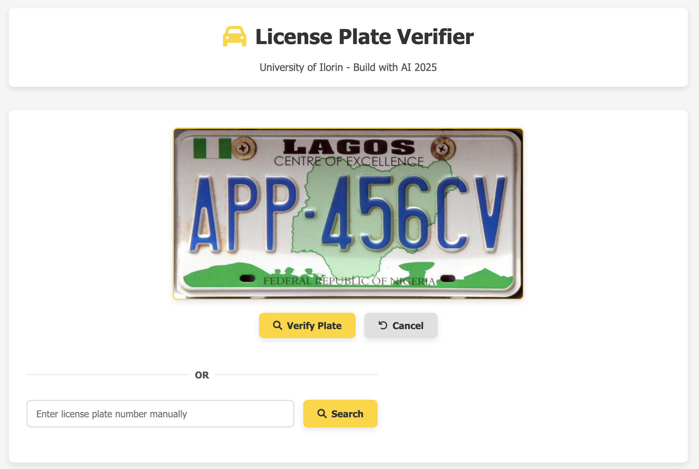
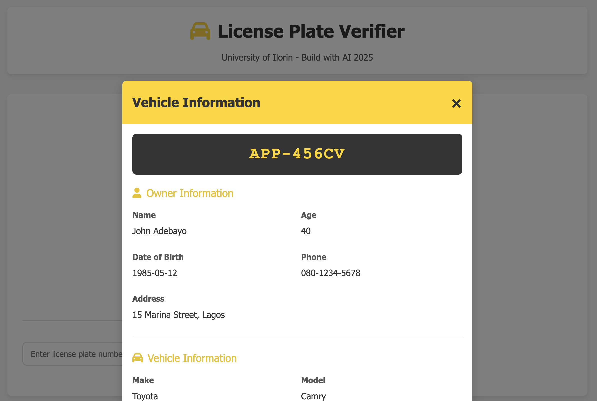

# License Plate Verification System

A comprehensive web application that uses Azure Document Intelligence (OCR) to identify license plate numbers from images and retrieve vehicle and owner information from a JSON database.



## Table of Contents
- [Project Overview](#project-overview)
- [Features](#features)
- [Technical Implementation](#technical-implementation)
- [Setup Instructions](#setup-instructions)
  - [Prerequisites](#prerequisites)
  - [Step 1: Create Azure Document Intelligence Resource](#step-1-create-azure-document-intelligence-resource)
  - [Step 2: Project Setup](#step-2-project-setup)
  - [Step 3: Configure Azure Credentials](#step-3-configure-azure-credentials)
  - [Step 4: Run the Application](#step-4-run-the-application)
- [Project Structure](#project-structure)
- [How It Works](#how-it-works)
- [Customization](#customization)
- [Troubleshooting](#troubleshooting)
- [License](#license)

## Project Overview

This system allows traffic management personnel to quickly verify license plate information by:

1. Uploading an image of a license plate
2. Taking a photo using the device camera
3. Entering a license plate number manually

After processing, the system displays detailed information about the vehicle, owner, registration status, and any recorded traffic offenses - all within seconds.



## Features

- **Optical Character Recognition (OCR)**: Uses Azure Document Intelligence to extract license plate text from images with high accuracy
- **Multiple Input Methods**: Upload, camera capture, or manual entry
- **Real-time Processing**: Quick license plate detection and database lookup
- **Comprehensive Results**: Displays detailed vehicle and owner information
- **Responsive Design**: Works on both desktop and mobile devices
- **Intuitive UI**: User-friendly interface with clear visual feedback
- **Nigerian License Plate Support**: Optimized for Nigerian license plate formats
- **Traffic Offense Records**: Displays history of traffic violations
- **Registration Status**: Shows whether vehicle registration is active or expired

## Technical Implementation

- **Backend**: Python Flask web application
- **OCR Engine**: Azure Document Intelligence (formerly Azure Form Recognizer)
- **Database**: JSON-based database with vehicle and owner records
- **Frontend**: HTML, CSS, and JavaScript with responsive design
- **Image Processing**: Client-side image handling and server-side OCR processing

## Setup Instructions

### Prerequisites

- Python 3.8 or higher
- Flask and related dependencies
- Azure account with Document Intelligence service
- Web browser with camera access (for the camera capture feature)
- Internet connection

### Step 1: Create Azure Document Intelligence Resource

 Also reference this resource
[Azure Document Intelligence Microsoft Learn](https://learn.microsoft.com/en-us/azure/ai-services/document-intelligence/how-to-guides/create-document-intelligence-resource?view=doc-intel-4.0.0)

1. Sign in to the [Azure Portal](https://portal.azure.com/)
2. Click on "Create a resource" and search for "Document Intelligence"
3. Click "Create" and fill in the required details:
   - **Subscription**: Choose your Azure subscription
   - **Resource group**: Create new or select existing
   - **Region**: Choose a region close to your location
   - **Name**: Choose a unique name for your resource
   - **Pricing tier**: Select "Free" for testing or "Standard" for production
4. Click "Review + create" and then "Create"
5. Once deployment is complete, go to your resource
6. In the left menu, click on "Keys and Endpoint"
7. Note down the "Key" and "Endpoint" values for later use

### Step 2: Project Setup

1. Clone or download the project files to your local machine
2. Create a new directory for the project and organize files as follows:
   ```
   license_plate_verifier/
   │
   ├── app.py
   ├── config.py
   ├── requirements.txt
   ├── static/
   │   ├── css/
   │   │   └── styles.css
   │   ├── js/
   │   │   └── main.js
   │   └── uploads/
   │
   ├── templates/
   │   └── index.html
   │
   ├── utils/
   │   ├── __init__.py
   │   ├── azure_ocr.py
   │   └── db_handler.py
   │
   └── data/
       └── plates_database.json
   ```

3. Create a virtual environment (recommended):
   ```bash
   # Windows
   python -m venv venv
   venv\Scripts\activate

   # macOS/Linux
   python3 -m venv venv
   source venv/bin/activate
   ```

4. Install required dependencies:
   ```bash
   pip install -r requirements.txt
   ```

### Step 3: Configure Azure Credentials

1. Open `config.py` in your text editor
2. Replace the placeholder values with your actual Azure credentials:
   ```python
   # Azure Document Intelligence Configuration
   AZURE_ENDPOINT = "https://your-resource-name.cognitiveservices.azure.com/"
   AZURE_API_KEY = "your-api-key"
   ```

### Step 4: Run the Application

1. Make sure your virtual environment is activated
2. Run the Flask application:
   ```bash
   # Windows
   python app.py

   # macOS/Linux
   python3 app.py
   ```
3. Open your web browser and navigate to `http://127.0.0.1:5000/`
4. The application should now be running and ready to use

## Project Structure

- **app.py**: Main Flask application with routes and request handling
- **config.py**: Configuration settings for Azure credentials and application
- **static/css/styles.css**: CSS styling with yellow as the primary color
- **static/js/main.js**: Frontend JavaScript for image handling and results display
- **templates/index.html**: Main HTML interface with upload options and results modal
- **utils/azure_ocr.py**: Integration with Azure Document Intelligence for OCR
- **utils/db_handler.py**: JSON database handler for license plate lookups
- **data/plates_database.json**: Sample database with Nigerian license plate records

## How It Works

1. **Image Upload/Capture**:
   - User uploads an image of a license plate or captures it with their camera
   - Frontend JavaScript handles the image preview and sends it to the server

2. **OCR Processing**:
   - The image is sent to Azure Document Intelligence
   - The custom model extracts the license plate number directly
   - The plate number is standardized to a consistent format

3. **Database Lookup**:
   - The extracted license plate number is standardized (uppercase, no spaces)
   - The application searches the JSON database for matching records
   - If found, the record is retrieved with all vehicle and owner details

4. **Results Display**:
   - A modal window shows comprehensive information about the vehicle
   - Details include owner information, vehicle details, registration status, and traffic offenses
   - Color-coded indicators show active/expired status

## Customization

### Adding More License Plates

To add more license plates to the database:

1. Open `data/plates_database.json`
2. Add new entries following the existing format:
   ```json
   {
       "plate_number": "NEW-123AB",
       "owner": {
           "name": "Owner Name",
           ...
       },
       ...
   }
   ```

### Training a Custom Model in Azure

For better accuracy, you can train your own custom model:

1. Go to your Azure Document Intelligence resource
2. Click on "Custom models" in the left menu
3. Click "Create a model"
4. Select "Custom template" as the model type
5. Upload at least 5 training documents (license plate images)
6. Label the license plate number field as "licensenumber"
7. Train and deploy the model
8. Use the model ID "licensenumber" in your code

### Changing UI Colors

To modify the application's color scheme:

1. Open `static/css/styles.css`
2. Change the CSS variables at the top of the file:
   ```css
   :root {
       --primary-color: #FFD700; /* Change this to your preferred color */
       --primary-dark: #E6C200;  /* Darker shade of primary color */
       --primary-light: #FFDF33; /* Lighter shade of primary color */
       ...
   }
   ```

## Troubleshooting

### Image Not Processing Correctly

- Ensure the license plate is clearly visible in the image
- Check that the image is not too dark, blurry, or at an extreme angle
- Try increasing the contrast of the image before uploading
- Verify your Azure Document Intelligence service is active and properly configured

### Azure API Connection Issues

- Verify your API key and endpoint in `config.py` are correct
- Check your Azure service subscription status
- Ensure your internet connection is stable
- Look for error messages in the server console

### Camera Access Problems

- Make sure your browser has camera permissions enabled
- Use a modern browser (Chrome, Firefox, Edge) with WebRTC support
- Try using HTTPS instead of HTTP if deployed online


## License

This project is created for educational purposes as part of the "Build with AI 2025" workshop at the University of Ilorin, presented by Abdulrafiu Izuafa, Senior AI/ML Engineer, Consultant at Onyx Data.

---

*For more information or support, contact workshop organizers at the University of Ilorin Innovation Hub.*
